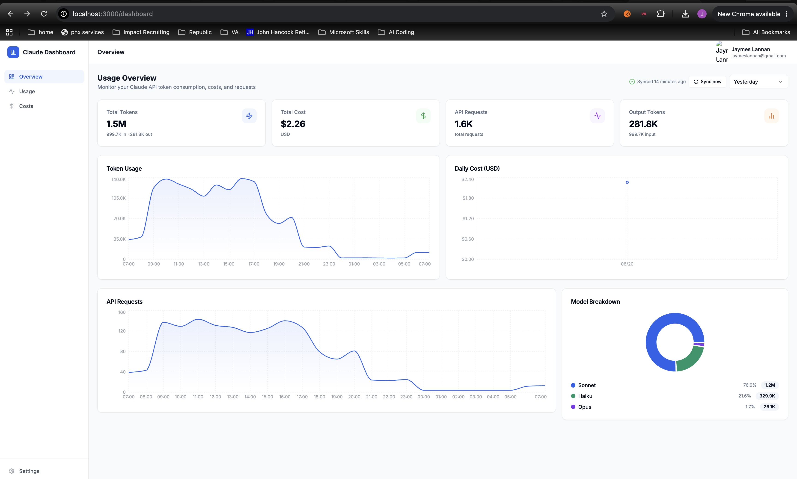

# Claude Dashboard



A self-hosted analytics dashboard for monitoring [Anthropic Claude](https://anthropic.com) API usage — token consumption, costs, request volume, and model breakdown — with hourly automatic data sync and robust date range filtering.


---

## Overview

The Anthropic Admin API exposes usage and cost data but provides no built-in dashboard. This project fills that gap — a full-stack web app that pulls data on a schedule and presents it in a clean, filterable UI.

**Key decisions:**
- **Self-hosted via Docker Compose** — data never leaves your machine; no third-party analytics
- **PostgreSQL + Prisma** — structured storage with type-safe queries and easy schema migrations
- **Separate sync worker** — decoupled from the web app so syncs run reliably on a cron schedule even if the browser isn't open
- **NextAuth.js with Google OAuth** — simple, secure authentication without managing passwords
- **Recharts** — lightweight charting library with good TypeScript support

---

## Features

- **Token analytics** — input, output, cache read, and cache creation tokens broken down by time
- **Cost tracking** — USD spend per day, filterable by date range
- **Request volume** — API request counts over time
- **Model breakdown** — usage split across Opus, Sonnet, Haiku, and Fable with a pie chart
- **Date range filtering** — presets (today, 7d, 30d, month-to-date) plus a custom calendar picker
- **Hourly sync** — background worker polls the Anthropic Admin API every hour at :05
- **Manual sync** — trigger an immediate sync from the dashboard at any time
- **Sync status** — shows last sync time and whether it succeeded or errored

---

## Tech Stack

| Layer | Technology |
|---|---|
| Frontend | Next.js 15 (App Router), React 18, TypeScript |
| Styling | Tailwind CSS v3, shadcn/ui, Radix UI |
| Charts | Recharts |
| Auth | NextAuth.js v4, Google OAuth |
| Database | PostgreSQL 16 |
| ORM | Prisma 5 |
| Sync worker | Node.js, node-cron |
| Deployment | Docker Compose |

---

## Architecture

```
┌─────────────────────────────────────────────────────┐
│                   Docker Compose                    │
│                                                     │
│  ┌──────────┐    ┌──────────┐    ┌──────────────┐  │
│  │          │    │          │    │              │  │
│  │ Next.js  │───▶│ Postgres │◀───│ Sync Worker  │  │
│  │  :3000   │    │  :5432   │    │  (cron 1h)   │  │
│  │          │    │          │    │              │  │
│  └──────────┘    └──────────┘    └──────┬───────┘  │
│                                         │           │
└─────────────────────────────────────────┼───────────┘
                                          │
                                          ▼
                              Anthropic Admin API
                         /v1/organizations/usage_report
                         /v1/organizations/cost_report
```

The sync worker runs independently of the web app. It polls the Anthropic Admin API on a cron schedule, upserts records into PostgreSQL, and logs each sync run. The Next.js app reads from the same database and serves the dashboard UI with API routes for metrics, time-series, and model breakdowns.

---

## Getting Started

### Prerequisites

- [Docker Desktop](https://www.docker.com/products/docker-desktop/)
- A [Google OAuth 2.0 client](https://console.cloud.google.com/apis/credentials)
- Optionally: an [Anthropic Admin API key](https://console.anthropic.com/settings/admin-keys) for live data sync

### 1. Clone the repo

```bash
git clone https://github.com/JaymesLannan/claude-dashboard.git
cd claude-dashboard
```

### 2. Configure environment variables

```bash
cp .env.example .env
```

Edit `.env` and fill in:

```env
POSTGRES_PASSWORD=your-db-password

NEXTAUTH_SECRET=        # generate with: openssl rand -base64 32
NEXTAUTH_URL=http://localhost:3000

GOOGLE_CLIENT_ID=       # from Google Cloud Console
GOOGLE_CLIENT_SECRET=   # from Google Cloud Console

ANTHROPIC_ADMIN_KEY=disabled   # set to sk-ant-admin01-... for live sync
```

**Google OAuth setup:**
1. Go to [Google Cloud Console → Credentials](https://console.cloud.google.com/apis/credentials)
2. Create an OAuth 2.0 Client ID (Web application)
3. Add `http://localhost:3000/api/auth/callback/google` as an authorized redirect URI
4. Go to **APIs & Services → OAuth consent screen → Audience** and set User Type to **External**, then add your Gmail as a test user

### 3. Start the stack

```bash
docker compose up --build -d
```

This starts the following services:
- `db` — PostgreSQL database
- `migrate` — creates all tables via Prisma then exits
- `seed` — populates 30 days of realistic demo data then exits
- `app` — Next.js web app on port 3000
- `worker` — hourly sync cron job (exits immediately if no Admin key is set)

### 4. Open the dashboard

Navigate to [http://localhost:3000](http://localhost:3000) and sign in with Google. The dashboard will be pre-populated with 30 days of realistic demo data.

To pull live data from the Anthropic API, set `ANTHROPIC_ADMIN_KEY` in your `.env` and click **Sync now** in the dashboard.

### Stopping

```bash
docker compose down          # stop containers (data preserved)
docker compose down -v       # stop containers and delete database
```

---

## Project Structure

```
claude-dashboard/
├── src/
│   ├── app/
│   │   ├── api/
│   │   │   ├── auth/[...nextauth]/   # NextAuth handler
│   │   │   ├── sync/                 # Manual sync trigger + status
│   │   │   └── usage/
│   │   │       ├── metrics/          # Aggregate totals for date range
│   │   │       ├── timeseries/       # Hourly/daily series for charts
│   │   │       └── models/           # Per-model breakdown
│   │   ├── dashboard/                # Protected dashboard UI
│   │   └── login/                    # Google OAuth sign-in page
│   ├── components/
│   │   ├── dashboard/                # MetricCard, UsageChart, ModelBreakdown, etc.
│   │   └── ui/                       # shadcn/ui primitives
│   └── lib/
│       ├── anthropic-sync.ts         # Admin API fetch + upsert logic
│       ├── auth.ts                   # NextAuth config
│       ├── db.ts                     # Prisma client singleton
│       └── utils.ts                  # Formatting helpers + model colors
├── sync-worker/
│   └── index.js                      # Standalone cron worker
├── prisma/
│   └── schema.prisma                 # DB schema (UsageRecord, CostRecord, SyncLog)
├── Dockerfile                        # Next.js app image
├── Dockerfile.worker                 # Sync worker image
└── docker-compose.yml                # Full stack definition
```

---

## Database Schema

```
UsageRecord   — hourly token buckets grouped by model/workspace/tier
CostRecord    — daily cost buckets from the cost report endpoint
SyncLog       — log of each sync run (status, records synced, errors)
User          — NextAuth user
Account       — NextAuth OAuth account link
Session       — NextAuth session
```

---

## Development

Run locally without Docker:

```bash
npm install
npx prisma generate
npx prisma db push        # requires a running Postgres instance
npm run dev               # starts Next.js on http://localhost:3000
```

For the sync worker:
```bash
cd sync-worker
npm install
node index.js
```

---

## License

MIT
